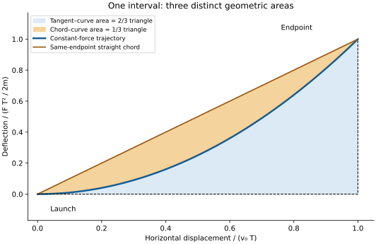

# Newton's vanishing areas and the proposed action scale

For perpendicular launch under constant force, the chord–curve lens area is
proportional to a matched-endpoint action difference. We compute the coefficient,
show how positive action differences approach zero, and relate the result to
quantum phase resolution. Newton's Lemmas X–XI provide the geometric anchors.
Calculation recorded 2026-09-05; exposition revised 2026-09-06.

## 1. What was read

We downloaded [the Motte/Chittenden 1846 text](../docs/Newton_Principia_Motte1846.md)
and read Definitions I–VIII and Scholium, the Laws with corollaries and Scholium,
Book I Section I, and Section II Propositions I–II. A
[Motte 1729 excerpt edited by Wilkins](../docs/Newton_Principia_BookI_SectionI_Motte1729_Wilkins2002.md)
supplies readable formulae for Section I. The reading coverage is these later
English witnesses and the passages listed below.

The closest passages are quite specific:

| Passage (1846 printed page) | Content relevant here |
| --- | --- |
| Definitions II, IV, VII–VIII (73–77) | Momentum and impressed force; accelerative versus motive force |
| Definition Scholium (77–82) | Distinguishes mathematical time and space from sensible measures |
| Laws, Corollaries V–VI (89) | Common uniform translation and equal parallel accelerations preserve relative motions |
| Laws, Scholium (89–90) | Explicit projectile parallelogram and parabolic path; attributes the result to Galileo |
| Lemmas I–III (95–96) | Limits and convergence of inscribed/circumscribed figures |
| Lemma X (99–100) | Initial force-generated displacement is quadratic in time |
| Lemma XI, Corollaries 4–5 (101) | Tangent triangles and curved segments scale cubically; segment is one third of the triangle |
| Section I closing Scholium (102–103) | Defines vanishing magnitudes through limiting ratios |
| Proposition I (103–105) | Equal swept areas for a polygon under central impulses, then a curve limit |
| Proposition II (105–106) | Converse relating area law to direction of resultant force |

Newton writes in the closing Scholium that he means “evanescent divisible
quantities” and defines the construction through limiting ratios. His example of
an “ultimate velocity” means the limiting velocity at an event. These passages
give the historical vocabulary for the continuity argument.

The source HTML contains modern editorial image descriptions. Some equations are
images; the Wilkins PDF was used where HTML
extraction omitted them. Selected historical figures were visually inspected:
[projectile](../docs/images/i_090a.jpg), [central polygon](../docs/images/i_104.jpg).

## 2. Constant-force geometry

Take a particle of mass $m>0$, a constant force $F>0$ in the positive $y$
direction, $V(y)=-Fy$, and initial data

$$
x(0)=y(0)=0,\qquad \dot x(0)=v_0>0,\qquad \dot y(0)=0.
$$

For an interval $\varepsilon>0$ the exact classical solution is

$$
x(t)=v_0t,\qquad y(t)=\frac{F}{2m}t^2.
$$

The particle deflects along the force and loses potential energy. Reversing the
vertical convention reverses the signs while preserving magnitudes.
Define the energy transfer by

$$
\delta E:=K(\varepsilon)-K(0)
=-\bigl[V(\varepsilon)-V(0)\bigr]
=F\Delta y=\frac{F^2\varepsilon^2}{2m}.
$$

Total mechanical energy is constant. Here $\delta E$ denotes deterministic work;
quantum energy spread will be written $\sigma_H$ below.
The proportionality constant in $\Delta y=K_{\rm conv}\delta E$
is $K_{\rm conv}=1/F$, which has dimensions of inverse force.

Let $A=(0,0)$, $B=(v_0\varepsilon,0)$ be the inertial endpoint and
$D=(v_0\varepsilon,F\varepsilon^2/(2m))$ the actual endpoint. The triangle $ABD$ has

$$
\mathcal A_\triangle=\frac12\Delta x\Delta y
=\frac{v_0F}{4m}\varepsilon^3
=\frac{v_0}{2F}\,\varepsilon\delta E.
$$

This confirms the proposed proportionality, with an explicit factor and energy
definition. Multiplying this configuration-space area by $F/v_0$ gives action
units. Section 3 obtains the action coefficient by direct integration.

For $y(x)=Fx^2/(2mv_0^2)$ the other two areas are

$$
\mathcal A_{\rm tangent,curve}=\int_0^{v_0\varepsilon}y(x)\,dx
=\frac23\mathcal A_\triangle,\qquad
\mathcal A_{\rm chord,curve}=\frac13\mathcal A_\triangle
=\frac{v_0F\varepsilon^3}{12m}.
$$

These are the ratios in Lemma XI, Corollary 5, exact for this parabola. The tangent
triangle is cubic in $\varepsilon$ because the initial vertical velocity is zero.
About a later point, deflection from the local tangent is again quadratic, while
absolute vertical displacement also includes the existing vertical velocity.

## 3. Matched-endpoint action difference

The same-endpoint straight chord is an admissible off-shell comparison path. On
$0\leq t\leq\varepsilon$, set

$$
y_{\rm cl}(t)=\frac{F}{2m}t^2,\qquad
y_{\rm ch}(t)=\frac{F\varepsilon}{2m}t,\qquad x(t)=v_0t.
$$

Compare both with the same Lagrangian

$$
S[x,y]=\int_0^\varepsilon
\left[\frac m2(\dot x^2+\dot y^2)+Fy\right]dt.
$$

For $y=y_{\rm cl}+\eta$, with $\eta(0)=\eta(\varepsilon)=0$, integration by parts
cancels the linear variation because $m\ddot y_{\rm cl}=F$. Consequently

$$
S[y_{\rm cl}+\eta]-S[y_{\rm cl}]
=\frac m2\int_0^\varepsilon\dot\eta^2\,dt.
$$

Here $\eta=F t(\varepsilon-t)/(2m)$ for the chord. Therefore

$$
\boxed{\Delta S_{\rm ch,cl}
=\frac{F^2\varepsilon^3}{24m}
=\frac{F}{2v_0}\mathcal A_{\rm chord,curve}
=\frac{\varepsilon\delta E}{12}.}
$$

The action integral fixes the coefficient relating the lens to the action
difference. Adding the same point-function term $dG(q,t)/dt$ to the Lagrangian
preserves the difference because endpoints and times agree.

The neighbouring paths form a continuous family. Choosing
$\eta=\alpha t(\varepsilon-t)$ gives

$$
\Delta S(\alpha)=\frac{m\alpha^2\varepsilon^3}{6}\longrightarrow0
\quad\text{as }\alpha\to0.
$$

Positive action differences in this family therefore have infimum zero.
A physical distinguishability relation or a restriction of allowed states changes
the admissible comparison; defining that change is the next modelling question.

## 4. Polygonal approximation and its error

Proposition I proves equality of finite swept triangles already at the polygonal
stage, using central impulses. Its swept triangles sum to the swept area over a
fixed time. By contrast, chord–curve lenses measure the error of the polygonal
approximation; their total has a different limit.

For the constant-force parabola, dividing a fixed duration $T$ into $N$ equal
intervals gives $N$ chord lenses, each of area $v_0F(T/N)^3/(12m)$. Their sum is

$$
\mathcal A_{\rm error,total}=\frac{v_0FT^3}{12mN^2}\to0.
$$

This gives the exact $N^{-2}$ convergence of the polygonal error. The constant
parallel force belongs to the projectile Scholium and Lemmas X–XI; Proposition I
assumes a force directed towards a fixed centre.

For constant force the displayed solution exists globally. Singular central forces
require collision and continuation analysis. The approximation above takes a mesh
limit; a semiclassical calculation instead varies the parameter $\hbar$.

## 5. Phase resolution, uncertainty and reference frames

The [Feynman chapter](../docs/Feynman_LeastAction_II19.md) supplies the quantum
interpretation through phases $e^{iS/\hbar}$. Equal phase occurs when an action
**difference** is $nh$, since $h=2\pi\hbar$. This is periodicity of the relative
phase. Classical stationarity concerns neighbourhoods of paths and their phase
cancellation.

For our specific chord comparison,

$$
\Delta\varphi=\frac{\Delta S_{\rm ch,cl}}{\hbar}
=\frac{F^2\varepsilon^3}{24m\hbar}.
$$

At fixed $\hbar>0$, $\varepsilon\to0$ makes these two phases closer. Requiring
order-one relative phase would define a comparison scale

$$
\varepsilon_{\rm phase}\sim\left(\frac{24m\hbar}{F^2}\right)^{1/3}.
$$

This comparison scale marks an order-one phase difference for the selected pair
of paths. The phase rule introduces a specified $\hbar$ as quantum input.
The [technical paper](../papers/action-gap-foundations.tex) turns relative phase
into an exact resolution threshold for a fixed measurement protocol and copy count.

For a time-independent observable $B$, the quantum commutator variance inequality and
Heisenberg evolution imply

$$
\sigma_H\sigma_B\geq\tfrac12|\langle[H,B]\rangle|,
\qquad
\tau_B:=\frac{\sigma_B}{|d\langle B\rangle/dt|},
\qquad \sigma_H\tau_B\geq\frac\hbar2,
$$

when domains and variances are appropriate and the denominator is nonzero.
Here $\sigma_H$ is a state energy spread and $\tau_B$ an observable-change
timescale. The earlier $\delta E$ and $\varepsilon$ describe deterministic work
and a chosen trajectory interval. A wavepacket uncertainty area concerns the
distribution of conjugate observables.

The spatial area also changes under a horizontal Galilean boost. In the frame
moving at $v_0$, horizontal launch velocity and the plotted spatial area vanish.
The action difference above stays finite and unchanged: both paths share the
same horizontal motion, whose action contribution cancels. Thus the area
conversion uses a frame with $v_0\neq0$, while the matched-endpoint action
difference survives the boost.

For $v_0<c$, the constant-force solution stays below $c$ whenever
$0<\varepsilon<(m/F)\sqrt{c^2-v_0^2}$. Arbitrarily small intervals remain possible.
This checks the speed of a finite Newtonian segment. Section 6 of the technical
paper supplies a corresponding small-variation calculation for the free
relativistic Lagrangian.

These results lead to an operational question: how does the action difference
determine distinguishability under specified preparations and measurements?
The complementary spectral question studies the effects of state space,
boundary conditions and periodicity.

## 6. Historical interpretation and reproduction

The modern interpretation starts from Newton's use of arbitrarily fine geometric
limits. The proposed implicit $h\to0$ reading is recorded as a historical
conjecture. Its chronology, relationship to the Classical Scholia and place in
the existing literature are tasks H02/H03.

The written derivation connects the geometric construction to the action
integral. The saved diagram and [earlier check output](../out/constant-force-checks.json)
remain historical artifacts. Their legacy generator is inactive because it
also executes symbolic verification.
