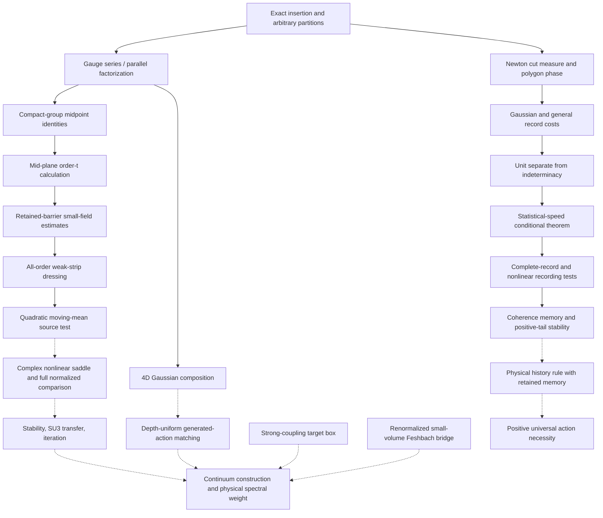

# Current research dependency graph

Navigation map, 2026-10-01. [STATE](STATE.md) selects work; this map does
not change that queue. [The catalog](../notes/index.md) covers every note.
Solid arrows below indicate recommended reading order; the accompanying
text identifies actual mathematical inputs and required corrections.
Dashed arrows mark proposed extensions or supporting transfers, not established
inputs to a completed continuum construction.

## Gauge: the next calculation

Read in this order:

1. [Refinement composition](../notes/refinement-composition-and-limit.md),
   exact insertion identities and the summable-error criterion.
2. [Series/parallel refinement](../notes/series-parallel-gauge-refinement.md),
   Prop. 1: directional halving isolates the interacting mid-plane integral.
3. [SU(2) midpoint](../notes/su2-midpoint-exact.md) and, when changing group
   or cut fraction, [centre-sensitive cuts](../notes/sun-midpoint-centre.md).
   Exact character traces do not supply all matrix entries or volume control.
4. [Order-t mid-plane calculation](../notes/su2-midplane-order-t.md),
   including torus holonomy and the normalized remainder obligation.
5. [Small-field notebook](../notes/su2-midplane-small-field.md), §§24–25
   for targets (112), (113), (116), then §§33–37 for the actual current inputs.

Durable inputs: uniform convexity and joint bad-set rarity, decaying response
kernels with contacts accounted for, an undifferentiated barrier, and a
convergent weak-recoupling gas. Section 35 supplies all-order connected
bad-component control **in its weak strip**. Section 36 constructs exact
dressed activities satisfying (112). Section 37 supplies a fixed source
radius and the subtracted log-barrier bound (177) in a centered quadratic
model. It is a test of part of (113), not the complete nonlinear integral.

The next mathematical step is complex centered nonlinear control with
decaying dependence of the moving saddle on boundary sources. Dependencies
are the fixed-barrier contour/source accounting of §37 and the locality and
connected-support reserves of §§33–36. Abandon a proposed estimate if it
differentiates the barrier, charges moving-mean amplification to every good
connector, assumes contact cancellation, or loses volume-uniform constants.
Physical recoupling, target-covering paths, curvature conversion, group
integral comparison, perturbed-action stability and iteration remain later
obligations. Check group constants before transferring SU(2) results to SU(3).

Keep these constraints within reach:
[local/global Agmon](../notes/agmon-global-not-local.md),
[blocking criterion](../notes/blocking-criterion-monotone.md),
[flow versus coarse graining](../notes/flow-conjugation-truncation.md),
[explicit weak-side thresholds](../notes/small-field-step-decay-and-threshold.md),
and [failed crossover bridges](../notes/reasons-to-stop-as-research.md).
The [obstruction map](obstructions.md) gives the scope of each failure.

## Gauge: four-dimensional matching and the spectral exit

For atlas cell 4 read [Gaussian blocking](../notes/gaussian-blocking-coupling.md)
→ [parallel logarithm](../notes/four-dimensional-parallel-log.md)
→ [4D composition](../notes/four-dimensional-composition.md), especially
its (14) and §7. Exact Gaussian Schur composition and finite one-step
subtractions are inputs; depth-uniform nonlinear contraction and remainder
control remain open. A formal one-loop coefficient is not iteration.

For a physical gap exit read
[lattice obligations](../notes/mass-gap-obligations-lattice.md), with the
[scaling-region correction](../notes/mass-gap-openings.md), then
[strong-coupling target](../notes/strong-coupling-target-box.md) and
[UV halving/IR confinement](../notes/uv-halving-ir-confinement.md).
Strong-coupling volume uniformity is durable. Reaching that box with controlled
generated interactions from a weak-coupling scaling trajectory is open.
T2′ at every bare coupling is stronger than the continuum argument needs.
Construction, nontriviality, volume uniformity, physical time and surviving
gauge-invariant spectral weight must each be supplied.

For STATE's supporting small-volume bridge read
[Feshbach reduction](../notes/weak-coupling-feshbach-reduction.md)
→ [torus valley](../notes/torus-valley-potential.md), together with the
[UV Schur correction](../notes/schur-error-ultraviolet.md).
H3 is the effective zero-mode valley-gap estimate. The full transfer also
needs H1's nonzero-mode separation and a renormalized/fibered H2 Schur bound;
the bare-vacuum error is not uniform as the cutoff is removed. Spectral moment or trial-state upper
bounds do not replace a positive lower bound.
The displayed cutoff torus calculation uses SU(2); applying this supporting
bridge to the main SU(3) goal also requires the corresponding group-dependent
operator estimates.

## Newton: the next mechanism

Read in this order:

1. [Fifth postulate](../notes/principia-fifth-postulate.md): joint determinacy
   is the statement under examination; the deformation and state-restriction
   alternatives both leave positivity as an additional obligation.
2. [Planck paper](../notes/planck-gap-paper.md), for the geometric observable
   and the resource-scoped Gaussian, recoil and general disturbance theorems.
3. [Unit and indeterminacy](../notes/necessity-unit-and-indeterminacy.md),
   separating a radiation action unit from a complete-record restriction.
4. [Indeterminacy routes](../notes/newton-indeterminacy-routes.md), for the
   conditional statistical-speed bound and its affine Gaussian instance.
5. [Recording notebook](../notes/sed-closure-under-recording.md), §§8.11–8.20:
   physical feedback, complete records and nonlinear countertests. In the
   supplied quantum free-evolution reference, the packet tests retain phase
   memory and distinguish positive-tail reconstruction from uniform stability
   in the stated local-data metric.

The next mechanism is a physical history rule that prepares and transports
the coherence datum through separation and reunion, with retained memory
and complete terminal records. It must account for the notebook's (117),
(119), phase datum (129), and §8.21's static bridge and unread-energy tests
(132)--(135), without assuming exact low-density readout or
importing the quantum evolution being explained. A rule that still admits
an unexcluded zero-action branch does not establish necessity.

Durable support: [cut measure](../notes/cut-measure-newton.md),
[recoil](../notes/record-costs-recoil.md),
[disturbance](../notes/record-costs-disturbance.md), and
[path length](../notes/record-distance-path-length.md).
The Gaussian action floor uses non-adaptive independent marks and
preparation-invariant tests. General instrument bounds allow wider protocols
but account for body/apparatus resources on the specified comparison states.

Retrieve [Leibniz continuity](../notes/leibniz-continuity-records.md) only
with its admissible Gaussian family and optimized invariant-test verdict.
Every fixed finite protocol can be continuous even at zero mark cost; the
positive-cost equivalence is a statement about that optimized family.
Uniformity over arbitrary adaptive complete-record apparatus is an additional
physical premise. The [stochastic route](../notes/stochastic-route-velocitas-ultima.md)
supplies composition of a common coefficient, not its nonzero value.
The [SED calibration](../notes/sed-zeta-radiation-link.md) retains its disputed
Planck-spectrum and resonant-variable hypotheses.

Avoid restarting prior-only covariance restrictions, thermodynamic record
costs, or phase/prequantization consistency as positivity proofs. Their
precise surviving statements are in [obstructions](obstructions.md).

## Orientation and supporting branches

The principal proof inputs can be read separately from the diagram's routing:

| Established input | Obligation it supplies |
| --- | --- |
| Exact series pushforward and compact-group midpoint identities | Defines the interacting mid-plane comparison; does not bound its normalized remainder |
| Convex reference, undifferentiated barrier, rarity and local connector majorants | Hypotheses for the weak-strip connected and dressed estimates (116)/(112) |
| Exact dressed gas and local affine moving means | Quadratic subtracted source bound (177), a limited test of (113) |
| Gaussian block Schur maps and generated one-step vertices | Formulation of the open depth-uniform subtracted matching estimate (14) |
| Dirichlet action/cut hats and invariant Gaussian mark constraints | Finite-grid distinguishability supremum; independent quantum instrument bounds use their own comparison-state hypotheses |
| Gaussian covariance/statistical-speed premise | Conditional classical disturbance theorem; neither a radiation unit nor prior covariance alone supplies complete-record closure |
| Compressed zero-mode gap, complementary-sector bound and relative Schur estimate | Conditional spectral gap transfer; the required physical bounds and SU(3) estimates remain open |

[Three continuum limits](../notes/three-continuum-limits.md) keeps the pion
comparison as a symmetry/spectral benchmark rather than a third construction
programme. [Halving atlas](../notes/halving-atlas.md) locates open cells;
[refinement results](../notes/refinement-results.md) is a compact theorem
entry point, with later notebook sections needed for the current frontier.
Historical proof architecture in `../newtonlean` is source/formalization
context, not a Lean-build dependency of these modern calculations.
